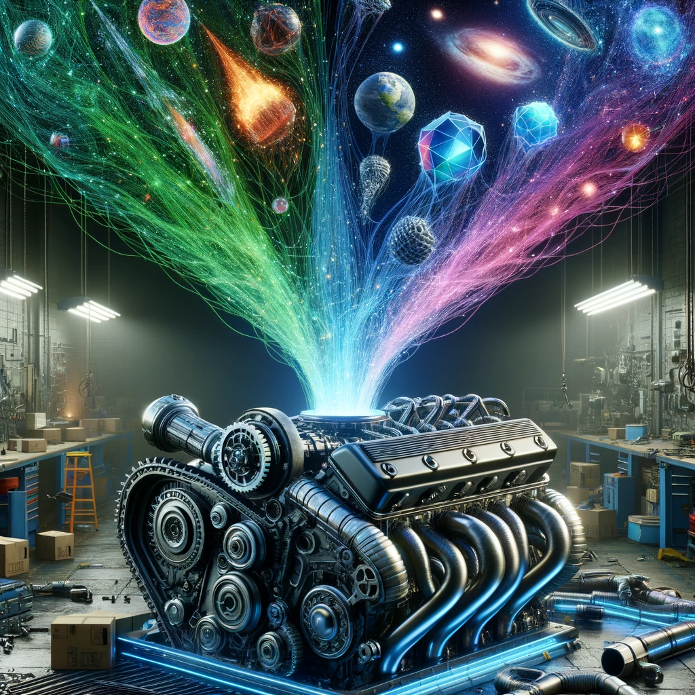

# Sourcery-Engine

## Overview
Sourcery-Engine is a cutting-edge game engine built using Mojo, designed to revolutionize game development by integrating AI-driven content generation for text, images, 2D/3D graphics, and voice. This engine provides a robust platform for creating next-generation games, supporting programming in Python, Mojo, or Runes.

Join our community on Discord: [Open-Sourcerers Discord](https://discord.gg/WXV4vF7cza)

Explore Runes for game scripting: [Runes on GitHub](https://github.com/ZackBradshaw/Runes)

**Project Repository:** [Sourcery-Engine on GitHub](https://github.com/Open-Sourcerers/Sourcery-Engine)

## Features
- **Cross-Platform Support:** Create games that run on Windows, macOS, Linux, and potentially mobile platforms.
- **AI Integration:** Seamlessly generate game content using state-of-the-art AI models for text, images, voice, and 3D/2D graphics.
- **Multi-Language Support:** Develop games using Python, Mojo, or Runes, offering flexibility in programming paradigms and styles.
- **Comprehensive Documentation:** Detailed guides and examples to help you get started and to harness the full potential of the engine.
- **Community Support:** Join the Open-Sourcerers Discord to connect with fellow developers and get support.

## Getting Started

### Prerequisites
- Ensure you have Python and Mojo installed on your system.
- Familiarity with basic game development concepts is recommended.

### Installation
1. Clone the Sourcery-Engine repository.
``git clone https://github.com/Open-Sourcerers/Sourcery-Engine.git``

2. Follow the installation instructions provided in the documentation to set up the engine and necessary dependencies.

## Architecture
Sourcery-Engine is modular, designed for extensibility and ease of use. Key components include:
- **Engine Core:** Manages the game loop, rendering, and event handling.
- **AI Module:** Interfaces with AI models for generating dynamic content.
- **Resource Manager:** Handles loading and management of game assets.
- **Scripting Support:** Allows game logic to be written in Python, Mojo, or Runes.
- **Networking:** Facilitates multiplayer game functionalities.

## AI Model Integration
The engine provides a wrapper for integrating various AI models, including guidelines for API keys, rate limiting, and best practices for generating content.

## Examples
Check out the `/examples` directory for starter projects and tutorials on using the Sourcery-Engine for game development.

## Contributing
We welcome contributions from the community! Please see our contribution guidelines for more information on how you can become a part of the Sourcery-Engine project.

## License
Sourcery-Engine is distributed under the MIT License. See the LICENSE file for more details.

## Community and Support
Join us on Discord to meet the team and other developers using Sourcery-Engine: [Open-Sourcerers Discord](https://discord.gg/WXV4vF7cza)